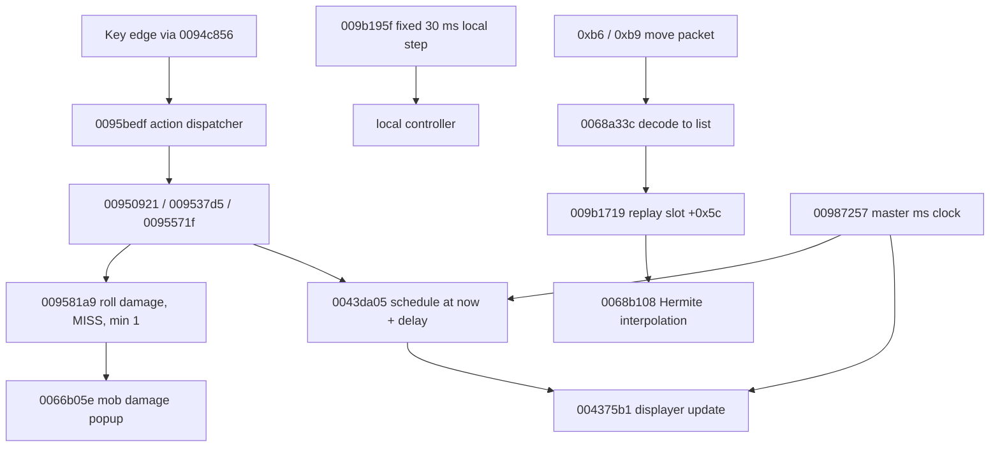

# Original client lag handling

For the proposed OpenMS prediction, action-queue and server-authority design, see
[Optimistic client and delayed actions](optimistic-client.md). This page records
original-client evidence; that proposal separates immediate feedback from trusted outcomes.

## Scope and provenance

This is decompilation evidence from the supplied `Maplestory_UNPACKED.exe`, SHA-256
`1198fa57ca5a7c489bae43ec13c69681d9cabe0f96762f3dc0357facf2e7d4df`, read with Ghidra
12.0.4 headless (`x86:LE:32:default:windows`, `-noanalysis -readOnly`). Addresses are
absolute image addresses. This is recovered machine code, not original C/C++ source, and
no Windows runtime was observed; statements below are marked as proved or as inference.

New reusable tools added by this investigation:

- `docs/tools/nativeRtti.java` — bounded MSVC RTTI inventory and vtable resolver.
- `docs/tools/nativeFunctions.java` — recovered function entries and sizes per address range.
- `docs/tools/nativeSymbols.java` — named/imported symbol dump.
- `docs/tools/nativeApiCallers.java` — imported-API callers, each decompiled once.
- `docs/tools/lagFieldSites.java` — displacement scan inside functions referencing a global,
  used here to prove the master-clock field is not written through the global.
- `docs/tools/lagDwordScan.java` — global dword-value scan, used to show that `0094a144`
  and `009581a9` are each referenced from exactly one table slot.
- `docs/tools/lagVtables.java`, `docs/tools/lagVtableMatch.java` — candidate-vtable
  enumeration and cross-correlation. They found no second table sharing the local-user
  method layout, so the remote-user class boundary remains open (see below).

The client is not built with recoverable class RTTI: only 16 `.?AV` descriptors exist and
they are all exception/`std` types. Class boundaries below are therefore established by
vtable data references and by the decoded string pool (`clientStrings.java`), not by names.



## Clock ownership

The client separates simulation from presentation, and remote actors add a third clock of
their own.

**Master millisecond clock.** The application/renderer singleton is `DAT_00be7b38`,
constructed at `009f4fda` and destroyed at `009f51f6`. Its `+0x18` is the current time:

```c
undefined4 FUN_00987257(void)          // 00987257
{
  return *(undefined4 *)(DAT_00be7b38 + 0x18);
}
```

`FUN_00987257` is the time source used by animation, cooldowns and effect lifetimes
(`004375b1`, `00505900`, `0094a144` and `0095bedf` among dozens). A displacement scan over
every function that references the singleton (`lagFieldSites.java`) finds only the
constructor write `009f5016 MOV dword ptr [ESI+0x18],EBX`; no other site stores to the
field through the global, so the per-frame update is reached through the object pointer
(the singleton is shared with the renderer, `Gr2D_DX8.dll`).

**Fixed 30 ms simulation step.** The base movement step is `009b195f`. It snapshots a
96-byte state block before advancing and returns the quantum `0x1e`:

```c
puVar3 = (undefined4 *)(extraout_ECX + 0x20);   // current state
puVar4 = (undefined4 *)(extraout_ECX + 0x80);   // previous state
for (iVar2 = 0x18; iVar2 != 0; iVar2 = iVar2 + -1) { *puVar4 = *puVar3; puVar3++; puVar4++; }
*(undefined4 *)(extraout_ECX + 0x1a0) = *(undefined4 *)(DAT_00bebfa0 + 0xac);
...
return 0x1e;                                     // 30
```

`009b16e8` dispatches the controller step with that literal:

```c
iVar1 = (**(code **)(*param_1 + 0x30))();
if (iVar1 != 0) { uVar2 = (**(code **)(*param_1 + 0x34))(0x1e); return uVar2; }
return 0;
```

Controller subclasses consume the returned quantum instead of a wall-clock delta:

- `009cbeb8` calls `009b195f`, then compares the integrated Y against the gravity constant
  at `*(DAT_00bebfa0 + 8) + 0x68` and increments a landing counter at `+0x248`.
- `009c20e4` accumulates `+0x254` by the returned amount and emits a `0x5a` (90 ms) event
  each time the accumulator passes `0x59` — a 90 ms cadence built from exactly three 30 ms
  steps.

The local character's per-frame update is `0094a144`, a virtual method (vtable slot
`00b3d20c`; the same class owns the nearby-hidden-portal selector `00950555`). It calls
input dispatch (`0094c856` at `0094a1c9`), the action handler (`0095bedf` at `0094bc07` and
`0094bc65`), the attack routine (`00950921` at `0094bbd3`) and the vector update
`009b1928`. `009b1928` drives the movement controller through virtual slots (`+0x24`,
`+0x28`, `+0x2c`, `+0x38`) rather than integrating directly.

Consequence: character logic advances in fixed 30 ms quanta independent of render rate and
of packet timing, while every animation reads a millisecond wall clock. The state snapshot
at `+0x20 → +0x80` is a previous-step copy; its exact presentation consumer was **not**
recovered here.

Remote characters use a third clock: their own fixed 30/32 ms move-path step, described
under [remote characters](#remote-characters-buffered-move-path-replay). Packet arrival
refills the replay buffer; it does not advance either clock.

## Local character: input-driven and immediately responsive

Input is read only while the game window has focus. `009cf76f` compares the singleton's
window handle `*(DAT_00be7b38 + 4)` against `(*DAT_00bf04e0)()`, reads key state through
`FUN_00451b6a`/`FUN_0059a25a`, then calls `FUN_009b7b4a(dirX, dirY)` and `FUN_009b19d0()`
to steer the local movement controller. Nothing in this path waits on the network.

Action dispatch runs on the key edge. `0095bedf` is the function-key/action handler called
from the key dispatcher `0094c856` (`0094cdf0`) and from `CUserLocal::Update` (`0094bc07`,
`0094bc65`). It computes the interval since the last accepted action
(`now - *(int *)(this + 0x312c)`), floors it at `0x1e` (30 ms) and caps it at the action's
authored delay (the action id lives at `this + 0x2ae8`), then calls the attack or UI routine
for the mapped action:

```c
local_8 = FUN_00987257();
local_8 = local_8 - param_1[0xc4b];             // byte offset +0x312c
if (local_8 < 0x1f) { local_8 = 0x1e; }         // 30 ms floor
iVar2 = FUN_00500971(param_1[0xaba]);           // action id at +0x2ae8
if (iVar2 <= local_8) { local_8 = iVar2; }      // cap
...
FUN_00950921(local_c, local_10, 0, 0, 0, local_8, 0);   // attack
```

`00500971` returns `1000` for the action codes it recognises and `2000` otherwise, so the
clamp is always `[30, 1000]` or `[30, 2000]` ms. The local attack routines
`00950921`, `009537d5` and `0095571f` are invoked from this edge, before any server reply.
The movement-packet send cadence itself was **not** recovered in this pass; only the
imported socket surface is known (`NMCO_CallNMFunc`/`NMCO_MemoryFree` from
`nmcogame.dll`, used through `006bea13`, whose callers build individual packets).

## Remote characters: buffered move-path replay

Remote actors do not run the local physics kernel. The server sends a move path; the client
decodes it into a list of 0x18-byte samples and replays that list on its own fixed-step
clock, interpolating between samples. This is the mechanism that hides packet jitter.

**Receive.** Move packets arrive through `0053e5a6 → 00531325 → 0097208c`. The user move
handler is opcode `0xb6` (`0093908f → 004fef90`) and the mob move handler is opcode `0xb9`
(`009726ae`); both resolve the actor's controller and call `0068b371`, the path setter
(named `CMovePath::SetMovePath` by shape; no class names survive in the binary). The same
setter serves the other entity families too (callers `004fefa9`, `009726cb`, `0066c1e5`,
`00704766`, `007a687a`, `006d3256`).

**Decode (`0068a33c`).** A path begins with `i16 startX, i16 startY, u8 count`, then `count`
records of 0x18 bytes:

| Offset        | Field                                                   |
| ------------- | ------------------------------------------------------- |
| `+0x00`       | move type `0..0x16` (jump table at `0068a507`)          |
| `+0x02/+0x04` | x, y                                                    |
| `+0x06/+0x08` | vx, vy                                                  |
| `+0x0a`       | movement attribute/action, used as `1 << (attr & 0x1f)` |
| `+0x0c`       | foothold id                                             |
| `+0x10`       | `tMove`: element **duration** in ms, not a timestamp    |

The list lives at `vecctrl + 0x1ac`; `+0x18` is the element count, `+0x78` the step,
`+0x84` the path clock and `+0x90` the remaining path time.

**A fixed step, not a wall clock.** The replay never calls `timeGetTime`/`GetTickCount`.
The per-call step is chosen when a path is received (`0068b43c..0068b472`): **32 ms** when
the accumulated path time reaches `X'`, otherwise **30 ms**, where `X' = (int)(X * 1.1)` is
550 or 1100 ms (`00af8590` = 1.1; `00af46e0` = 30.0, `00af8588` = 32.0). The path clock
carries over between packets — `SetMovePath` never resets `+0x84` — so consecutive updates
join without a seam.

**Replay (`009b1719`, controller vtable slot `+0x5c` → `0068adcc`).** Each call advances
`m_tCur += m_tStep`, consumes every sample whose `tMove` has elapsed (subtracting `tMove`
and accumulating an attribute bitmask), caches the consumed sample's x/y/vx/vy/foothold and
then interpolates:

```asm
0068ae07  ADD EAX,EBX                       ; m_tCur + m_tStep
0068ae10  CALL FUN_004165b1                 ; store m_tCur
0068ae54  MOVSX ECX,word ptr [EDI+0x10]     ; elem.tMove
0068ae58  CMP EAX,ECX
0068ae5a  JL 0x0068af27                     ; not elapsed -> interpolate
```

**Cubic Hermite interpolation (`0068b108`).** With `t = m_tCur / next.tMove`:

```c
h00 = 3*t*t - 2*t*t*t;        // smoothstep
h10 = 1 - h00;                // 2t^3 - 3t^2 + 1
w5  = (t*t - 2*t + 1) * dt;   // (1-t)^2 * dt
w6  = (t*t - t) * dt;         // t*(t-1) * dt
x = prevVx*w6 + prevX*h10 + nextVx*w5 + nextX*h00;
```

Both the previous sample's **position and velocity** participate, so the replay reproduces
the sender's curve between samples instead of lerping. Output velocity is re-derived as
`dx * 100/3` (`00af8580`), i.e. the code assumes a 30 ms frame.

**End of path and long gaps.** When the list empties it is cleared and the actor **holds its
last position and velocity**; there is no extrapolation branch, so a remote actor that stops
sending simply stops. A newly received path whose unconsumed time exceeds `X' + 5000` ms
(about 5.5–6.1 s) is discarded and replaced by one synthetic `moveType == 3` sample, which
the replay applies as a hard snap. Both are deliberate policy choices: hold for ordinary
gaps, snap only when the backlog proves the actor has already moved on.

**Open.** The exact per-frame actor loop that calls slot `+0x5c` was not located. After
scanning all 1 619 911 instructions, the only `CALL [reg+0x5c]` sites are COM/UI wrappers,
no controller vtable address is ever written as an immediate, and the objects appear to take
their vptr from a data template. The entity linkage is proved (user controller pointer at
`+0xdc`, mob at `+0x11a4`), but the driver that invokes the replay remains open.

## Effects and damage numbers are a client-owned queue

The global animation/damage-number displayer is `DAT_00bebf6c`, constructed at `00435444`.
Its constructor loads `Effect/BasicEff.img` (string id `968`) and the damage digit sets
`NoRed0/1`, `NoBlue0/1`, `NoViolet0/1`, `NoCri0/1` (ids `969`–`976`) and `Miss` (`984`).
The live object uses the vtable at `00af0d8c`, whose slot 0 is the per-frame update
`004375b1`; the digit sub-objects use `00af0d94/00af0d98/00af0d9c/00af0da0`, and
`00af0da4` is the transient table installed during construction.

The displayer is written from many independent systems, which is the structural reason
combat feedback does not depend on a round trip:

| Writer     | Role (recovered)                      |
| ---------- | ------------------------------------- |
| `00950921` | local attack path                     |
| `009537d5` | local attack path                     |
| `0095571f` | local attack path                     |
| `00662884` | mob update                            |
| `00666362` | mob update                            |
| `0092ec50` | skill effect dispatch                 |
| `009377d9` | skill effect dispatch                 |
| `00981211` | UI/notice effect                      |
| `004ad63f` | field update that ticks the displayer |

Per-frame advance and draw is `004375b1` (vtable slot 0 at `00af0d8c`). It reads the master
clock (`iVar5 = FUN_00987257()`) and decays the double at `+0x190` by the factor at
`+0x1a0` using timestamps `+0x198`/`+0x19c`. `004ad63f` invokes that slot through the
singleton (`(**(code **)*DAT_00bebf6c)()`). Effects therefore advance on the clock, not on
packet arrival.

**Scheduling and stagger.** `0043da05` is the scheduler used by the local attack paths and
by mob code. It writes four fields on a displayer slot from the master clock:

```c
void FUN_0043da05(int displayer, double scale, int critical, int delay, int extra, int force)
{
  if ((*(int *)(DAT_00bebf9c + 0x88) != 0) || (force != 0)) {
    *(double *)(displayer + 0x190) = scale;               // initial scale (16.0, or 26.67)
    iVar2 = FUN_00987257();
    *(int *)(displayer + 0x198) = iVar2 + delay;          // visible-from time
    *(uint *)(displayer + 0x19c) = iVar2 + delay + extra + 2000 - (critical ? 500 : 0);
    *(double *)(displayer + 0x1a0) = extra != 0 ? 1.0 : (critical ? 0.85 : 0.92);
  }
}
```

`004375b1` refuses to draw before `+0x198` (`iVar5 != *(int *)(this + 0x198) &&
-1 < iVar5 - *(int *)(this + 0x198)`), so `delay` staggers numbers created in the same
frame instead of stacking them. A number lives `2000 ms` (`1500 ms` when critical), and the
scale is multiplied by `+0x1a0` on each draw rather than by elapsed time — a
per-presentation decay, not a per-millisecond one. The local attack `00950921` reaches this
scheduler directly:

```asm
00951af2  PUSH 0x0
00951af6  PUSH dword ptr [EBP-0x54]      ; per-action base delay
00951af9  PUSH EAX                       ; critical flag
00951afc  MOV ECX,dword ptr [0x00bebf6c] ; displayer singleton
00951b05  CALL 0x0043da05                ; schedule the number
```

The scale passed here is `400.0 / 25.0` (16.0), or `400.0 / 15.0` (26.67) for the special
action `0x10f3e0`; the critical flag comes from the same comparison
(`00951ad1..00951aec`, doubles at `00b3d338`=25.0, `00b3d340`=15.0, `00af3740`=400.0).

**Multi-line stagger.** Inside `00950921` each damage line stores its start delay at record
offset `+0x10`:

```c
if (action == 0x40413c) delay = base + (i != 0 ? 0x118 : 0);      // 280 ms after the first
else { d = i * 0x46; if (d > 0x118) d = 0x118; delay = base + d; } // 70 ms/line, cap 280
```

So multiple lines are spread by **70 ms per additional line, capped at 280 ms**, or a flat
**280 ms** for action `0x40413c`. `base` is `0`, `120` (`0x78`) or `1380` (`0x564`) ms for
specific actions, or an attack-speed table lookup. `009537d5` separately accumulates a
coarser `0x190` (400) per line.

Other display entries recovered on the same paths: `00436ce9` (positioned, timed number;
called with a 180 ms delay and 3000/2760 ms duration from `0095571f`), `004365db`
(rectangle-based effect) and `0043612f` (critical/special family).

## Mobs: hits are decided and shown locally

The hit reaction and its damage number are produced on the attacking client, in the same
call chain as the key press. The attack action starts locally: `0096a86e` stores the action
id in `char+0x2ae8`, the master-clock tick in `char+0x312c` and the active flag in
`char+0x3134`. Damage is rolled and applied locally in `009581a9`:

```asm
0095848f  CMP dword ptr [EBP+0x8],EBX     ; rolled damage
00958492  SETLE AL                        ; damage <= 0 -> MISS
00958ff8  MOV dword ptr [EBP+0x8],0x1     ; minimum 1 when the miss flag is clear
00958a83  ADD EAX,0x64                    ; popup spawn time = now + 100 ms
00958a93  CALL 0x0066b05e                 ; create the mob damage popup
0095931c  CALL 0x0095bedf                 ; start the attack display
```

`0066b05e` creates the mob damage popup and stamps the mob when the attacker is the local
user (`DAT_00bebf98 + 0x11a8`). No packet payload feeds this chain; the only network-facing
part of combat is the outbound attack report.

**Reaction animation.** Mob action names are registered by `004a6c05` in a fixed index
order: `stand`, `jump`, `fly`, `regen`, `bomb`, `hit1` (1053), `hit2` (1054), `hitF`
(1055), `die1` (1066), `die2` (1067), `dieF` (1068), then `attack1`–`attack8`. The
per-template loader `0067cf06` loads `jump/fly/stand/regen`, the `invincible` flag (2898)
and `damagedByMob`/`damagedBySelectedMob`/`damagedBySelectedSkill` (3773/4273/4274), and
attaches per-animation properties to `attack` (1145) and `die` (1065). No site other than
`004a6c05` pushes the `hit1`/`hit2`/`hitF` ids, so the reaction is selected by index; the
selector itself was not recovered.

**Post-hit window.** Action handlers stamp a window pair on the acting character:
`0095571f` sets `+0x2b28 = now` and `+0x2b2c = now + 3000` ms (`00956d43`/`00956d49`, or
2760 ms for two actions), `0094e5e5` reuses the pair as a 600 ms repeating window, and
`00950921` stamps a 1 ms window. `009581a9` skips a hit when `+0x2b34` and `+0x2b40` are both
set, and `009535ac` sets `+0x2b34 = 1`. Whether these fields mean "invincible" is inferred,
not proved.

## Items and drops

The drop object's state machine `00504bff` walks its list at `+0x2c` and advances each drop
by the ms delta supplied on the stack, not by a message:

```c
iVar6 = *(int *)(unaff_EBP + 8) - *(int *)(iVar4 + 0x40);   // delta - drop age
```

Rotation is assigned at `00506142` inside `00505900` from the master clock
(`uVar4 = FUN_00987257();` at function entry), and meso frame delays are inserted at
`00506e62`. The recovered equations and the browser's presentation policy are in
[drop motion](drop-motion.md); this pass adds only the clock ownership.

## What this implies for OpenMS

1. Keep the fixed 30 ms simulation kernel and the separate millisecond presentation clock.
   Mixing packet arrival into either clock reintroduces stutter.
2. Keep the local player's own motion client-owned and immediately responsive; the native
   client never blocks movement on a server echo.
3. Spawn local combat visuals on the input edge, not on confirmation. The native action
   handler calls the attack routines directly and only floors the interval at 30 ms.
4. Replay remote move paths on a fixed step, carrying the clock across packets and
   interpolating with the previous sample's velocity — not with a raw lerp and not from
   packet arrival. Hold the last state when a path runs out and reserve hard snapping for a
   backlog that proves the actor has moved on.
5. Never gate an animation on packet arrival; every native animation samples the master
   clock. Damage numbers are scheduled ahead by an explicit per-line delay and expire after
   a fixed lifetime.
6. Implemented. [Online movement](movement-parity.md#remote-motion) now buffers remote
   publications, interpolates them with a Hermite that uses position and velocity, carries
   its playout clock across packets, bounds extrapolation and coasts to rest, and reconciles
   by rate-limited chase rather than by snapping. The local player's own reconciliation in
   [prediction.js](../client/src/online/prediction.js) absorbs sub-pixel error, eases larger
   error with a smoothstep window capped at walk speed, and presents only a disagreement
   beyond the band outright.
7. Implemented. The attacking client resolves its own hit presentation in
   [local-hits.js](../client/src/online/local-hits.js) at the authored release frame: it tests
   the same admitted rectangle (`attackRectangle`/`actionWeapon`) against each mob's authored
   receiver for the frame it is drawn with, rolls `PhysicalDamage` from the projected stats the
   server itself publishes, draws the number (immediately for melee, after the previewed flight
   for a ray) and starts the authored `hit1` pose. The server still owns admission, HP, death,
   knockback, drops and rewards; a positive authoritative event for the same target consumes the
   local prediction so the digits are not drawn twice, and a refusal or miss is still shown as a
   correction.

## Implementation status

| Native mechanism                        | Browser implementation                                                                    |
| --------------------------------------- | ----------------------------------------------------------------------------------------- |
| Move packet `0xb6` sample list          | un-acked `peers` frame, one changed peer sample per 30 ms tick ([peer-move-path.txt](ghidra-physics-motion/peer-move-path.txt)) |
| Carry-over replay clock (`SetMovePath`) | `remote-motion.js` buffer keyed on arrival time; never reset by a packet                  |
| Hermite with velocity (`0068b108`)      | `RemoteMotion.hermite`, plus `clampContact` to the landed sample's foothold surface        |
| Fixed 30/32 ms step                     | `PROTOCOL.TICK_MS`; playout slewed from the measured sample cadence                        |
| Hold at end of path (`0068adcc`)        | bounded forecast then exponential coast to rest                                           |
| Snap only on relocation (`0068b492`)    | `HARD_SNAP_PX` presentation plus generation reset                                         |
| Local input edge (`0094a144`)           | unchanged; `OnlinePrediction` + `LocalCombat`                                             |
| Scheduled damage numbers (`0043da05`)   | `CombatPresentation` lifetime and per-line delay                                          |
| Swept mob receiver (`00664559(...,1)`)  | `SkillAttack.targetBody` unions the current and previous body                             |
| View-time hit judgement (`00678476`)    | `attackRewindTicks` widens the same sweep over the measured view window                   |
| Local damage and popup (`009581a9`)     | `local-hits.js` records damage and draws the popup at the release frame                   |
| Attack display (`0095931c`)             | `local-hits.js` starts the authored `hit1` pose from the local reaction                   |
| Ordinary receiver (`00af14b8/c8`)       | `local-incoming.js` tests the drawn swing's area against it and predicts the digit        |

One earlier proposal is superseded by the move stream above. A **per-tick sample stream inside
the 90 ms entity view** really would not have shrunk anything, because that view is serialized
behind the application-level ack and so is bounded by the **round trip**, not by its 90 ms
period: at 500 ms ping a peer's published position refreshed only about twice a second and
every forecast had to bridge a full round trip, which is what produced the floating and the
brief floor penetration. Publishing the sample stream un-acknowledged, as the native move
packet was, decouples it from the receipt. A dense per-tick stream converges to the **60 ms**
playout floor and interpolates between two authentic 30 ms states, so the forecast horizon
collapses and the landing can be clamped to the sender's own contact.

**Implemented, as an OpenMS extension.** A mob's attack on the local player is published as
the mob's own action, so the swing the defender draws already carries the playout delay on
top of the entity publication cadence, while the `combat.impact` that names the player
arrives about half a round trip later. [local-incoming.js](../client/src/online/local-incoming.js)
now resolves that digit and the authored flinch face at the frame the drawn swing reaches its
authored `attackAfter`, against the same authored area and the same ordinary receiver the
authority tests. This is
presentation only: HP, death, knockback, status and the hit sound remain authoritative, and
the confirmed impact consumes the prediction so the digit is drawn once. The original client
does not predict incoming damage — it is decisive for its own outgoing attack
(`009581a9`/`0096a86e`) and server-driven for damage it receives — so this is marked as a
latency policy for the 500 ms link, not a recovered Nexon rule. The browser still does not
predict a mob's knockback displacement: the server's divert merges the impulse into the local
kernel, which then owns the resulting trajectory.

## Reproduce

```sh
# One-time: import and analyze the supplied unpacked executable into a scratch project.
# JAVA_HOME must point at a JDK 21; artifacts/ is ignored storage, so the project is local.
/Users/k/Downloads/ghidra_12.0.4_PUBLIC/support/analyzeHeadless \
  artifacts/ghidra-scratch lag -import ../Maplestory-Client/Maplestory_UNPACKED.exe

# Address-directed decompilation and xrefs (read-only, no re-analysis).
/Users/k/Downloads/ghidra_12.0.4_PUBLIC/support/analyzeHeadless \
  artifacts/ghidra-scratch lag -process Maplestory_UNPACKED.exe -noanalysis -readOnly \
  -scriptPath docs/tools -postScript clientFocus.java /tmp/out.txt \
  00987257,009b195f,009b16e8,0095bedf,00435444,004375b1,00504bff,0043da05
/Users/k/Downloads/ghidra_12.0.4_PUBLIC/support/analyzeHeadless \
  artifacts/ghidra-scratch lag -process Maplestory_UNPACKED.exe -noanalysis -readOnly \
  -scriptPath docs/tools -postScript clientFocus.java /tmp/move.txt \
  0097208c,0093908f,004fef90,0068b371,0068a33c,0068adcc,009b1719,0068b108

# Imported time-API consumers, each decompiled once.
/Users/k/Downloads/ghidra_12.0.4_PUBLIC/support/analyzeHeadless \
  artifacts/ghidra-scratch lag -process Maplestory_UNPACKED.exe -noanalysis -readOnly \
  -scriptPath docs/tools -postScript nativeApiCallers.java /tmp/ticks "GetTickCount,timeGetTime"

# Decoded original string pool with ids and consumers.
/Users/k/Downloads/ghidra_12.0.4_PUBLIC/support/analyzeHeadless \
  artifacts/ghidra-scratch lag -process Maplestory_UNPACKED.exe -noanalysis -readOnly \
  -scriptPath docs/tools -postScript clientStrings.java /tmp/strings.txt
```

`artifacts/` is ignored storage; the raw exports for this pass are under
`artifacts/ghidra-lag/`.
